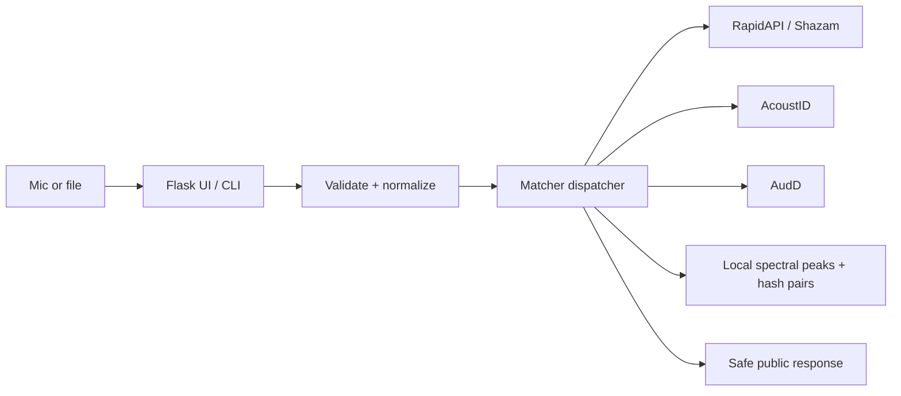

# DIY Shazam — presentation outline

**Status:** Source-verified showcase draft. The repository is a locally validated prototype, not a verified live production demo. This audit PR branch is `codex/audio-recognition-p0-audit` at `6eb46cf`; local pytest (193), Ruff, and diff checks passed, while the latest remote CI evidence applies to merged `origin/main`/PR #8 and no current-branch CI status entries are reported.

**Audience:** General portfolio audience

**Purpose:** Portfolio / technical project walkthrough

**Length:** 7 slides, approximately 2 minutes spoken

**Live demo:** None supplied; browser screenshots remain an evidence gap.

## Slide 1 — DIY Shazam

**Main message:** A self-hosted song-recognition workflow that accepts a microphone recording or audio file and routes it through multiple matching backends.

**On-slide points:**

- Identify a song from a microphone or upload
- Flask browser UI plus CLI entry point
- RapidAPI/Shazam, AcoustID, AudD, and local fingerprint backends

**Recommended visual:** A real screenshot of the Flask home screen showing the upload and recording controls. **[NEEDS EVIDENCE]** No live demo or current browser screenshot was supplied. Use `docs/screenshots/fft-output.png` only as a technical fallback, labeled as a diagnostic spectrum rather than a product screenshot.

**Speaker notes:** “This is DIY Shazam: a song-recognition project built around a practical input pipeline and several interchangeable backends. The interesting part is not just calling an API; it is making microphone input, uploaded files, validation, fallback, and safe failure states behave consistently.”

**Evidence:** [`readme.md`](../../readme.md), [`web/templates/index.html`](../../web/templates/index.html), [`main.py`](../../main.py)

## Slide 2 — The problem and the user

**Main message:** Recognition is easy to demo with one clean clip, but reliable behavior requires controlling input formats, duration, dependencies, provider failures, and honest evaluation.

**On-slide points:**

- Audio arrives from different devices and formats
- Providers can be missing, slow, unavailable, or return no match
- Upload and quota limits must protect the server
- The target user is a developer or learner exploring a DIY recognition workflow

**Recommended visual:** A simple input-to-decision flow: microphone/file → validation → matching → result or safe failure.

**Speaker notes:** “The project is aimed at a developer or learner who wants to understand the full path from audio input to recognition. The hard engineering problem is the boundary between messy audio and a dependable response: malformed files, unsupported formats, provider errors, rate limits, and no-match outcomes all need explicit handling.”

**Evidence:** [`readme.md`](../../readme.md), [`TODO.md`](../../TODO.md), [`docs/01-product-requirements.md`](../../docs/01-product-requirements.md)

## Slide 3 — The primary user journey

**Main message:** The browser keeps the interaction simple while the server owns normalization, matching, and safe public responses.

**On-slide points:**

- Upload WAV, MP3, M4A, AAC, OGG, FLAC, or WEBM, or record in-browser
- Convert non-WAV web uploads through bounded FFmpeg
- Normalize to mono float32 at the configured internal rate
- Return `matched`, `no_match`, `not_configured`, `invalid_audio`, `rate_limited`, or `error`

**Recommended visual:** A six-step journey diagram with the six public statuses as the outcome set.

**Speaker notes:** “From the user’s perspective, the flow is deliberately short: choose a file or record, submit, and read the result. The server converts supported web formats, validates size and duration, normalizes the signal, tries the configured matcher order, and exposes a stable response shape without leaking provider payloads or secrets.”

**Evidence:** [`web/templates/index.html`](../../web/templates/index.html), [`web/app.py`](../../web/app.py), [`shazam_project/recorder.py`](../../shazam_project/recorder.py), [`readme.md`](../../readme.md)

## Slide 4 — Product walkthrough

**Main message:** The Flask UI is a focused recognition surface with recovery-oriented states, not a collection of disconnected demos.

**On-slide points:**

- Recording controls and waveform visualizer
- File upload and server capability status
- Matched, no-match, invalid-input, rate-limit, and retry states
- Light/dark theme and optional session-only history

**Recommended visual:** A three-panel screenshot sequence: empty home, result/error state, and history/details. **[NEEDS EVIDENCE]** Capture these from the actual Flask app after restoring a usable runtime or supplying a live URL.

**Speaker notes:** “The UI is intentionally small: the main job is to capture audio and communicate the next state clearly. The current branch also hardens browser recovery by making storage optional and stopping microphone tracks and visualizer resources when recording ends or fails.”

**Evidence:** [`web/templates/index.html`](../../web/templates/index.html), [`web/static/app.js`](../../web/static/app.js), [`tests/test_web.py`](../../tests/test_web.py), [`tests/test_ci_hardening.py`](../../tests/test_ci_hardening.py)

## Slide 5 — Technical approach

**Main message:** One shared audio contract feeds a fallback dispatcher and an educational local constellation-hash implementation.

**On-slide points:**

- Downmix, validate, resample, and bound audio once
- Try RapidAPI/Shazam → AcoustID → AudD → local index as configured
- Local matching uses spectral peaks, hash pairs, and time-offset consensus
- Production path adds FFmpeg, Gunicorn, health/readiness checks, and quota controls

**Recommended visual:**

**Speaker notes:** “The central design decision is the shared `AudioClip` contract: mono floating-point audio at one internal sample rate, with explicit duration and size limits. The dispatcher can fall through after a provider error, no match, or missing configuration. The local backend is a transparent learning implementation based on spectral peaks and hash-pair offsets; FFT output is diagnostic only.”

**Evidence:** [`shazam_project/recorder.py`](../../shazam_project/recorder.py), [`shazam_project/matcher.py`](../../shazam_project/matcher.py), [`shazam_project/fingerprint.py`](../../shazam_project/fingerprint.py), [`Dockerfile`](../../Dockerfile), [`render.yaml`](../../render.yaml)

## Slide 6 — Validation and current proof

**Main message:** The engineering gates are substantial, but recognition quality is not yet proven by a real-world corpus.

**On-slide points:**

- Merged-main CI: 190 tests per Python 3.10–3.12 matrix job
- Merged-main branch coverage: 81%, above the 70% gate
- Ruff, pip-audit, Gitleaks, Render schema, and container smoke passed remotely
- Benchmark tooling exists, but no complete corpus or credentialed provider run is imported
- Current audit branch has local checks but is not yet separately remote-CI-verified

**Recommended visual:** A two-column “verified / still open” scorecard. Do not show invented accuracy or latency values.

**Speaker notes:** “The strongest remote evidence is engineering validation on merged main: the CI run covered tests, coverage, linting, dependency and secret scans, Render schema validation, and production-container smoke. This audit branch also passes 193 local tests, Ruff, and diff checks, but that does not replace remote CI or prove song-recognition quality. The benchmark is deliberately gated until there are 30 legally reusable source tracks, 90 microphone clips per backend, three recording conditions, operator metadata, and provider configuration.”

**Evidence:** [Merged PR #8](https://github.com/icecold009/Audio-Recognition/pull/8), [`evaluation/README.md`](../../evaluation/README.md), [`scripts/benchmark.py`](../../scripts/benchmark.py), [`TODO.md`](../../TODO.md)

## Slide 7 — Lessons, limitations, and next steps

**Main message:** The next milestone is evidence quality, not another feature.

**On-slide points:**

- No real-world accuracy, latency, or catalog-coverage claims yet
- Browser-engine tests and screenshot evidence remain open
- Provider credentials, FFmpeg/fpcalc host setup, and a clean local runtime are external prerequisites
- Next: run the reproducible benchmark, add browser smoke coverage, re-run CI on this branch, then publish only generated results

**Recommended visual:** A short “now → next” roadmap.

**Speaker notes:** “The project taught me to separate a convincing demo from a trustworthy claim. The next useful work is not to add another backend; it is to collect legal, reproducible evidence, verify the browser journey, and make the current branch pass the same release gates. Until then, the honest status is: technically hardened and CI-validated on merged main, but not quality-benchmarked or live-demo verified.”

**Evidence:** [`TODO.md`](../../TODO.md), [`evaluation/README.md`](../../evaluation/README.md), [`evidence-checklist.md`](evidence-checklist.md)
